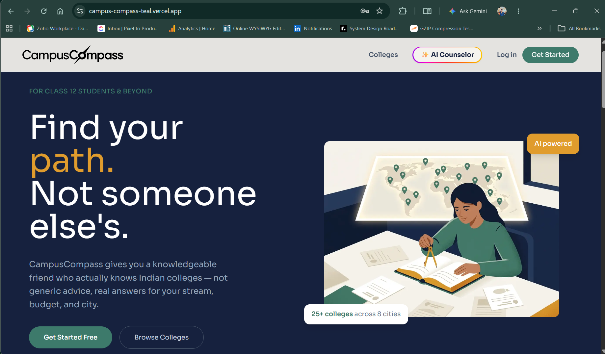
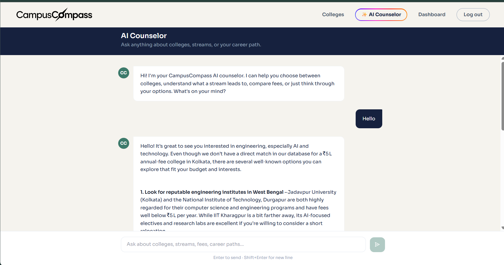
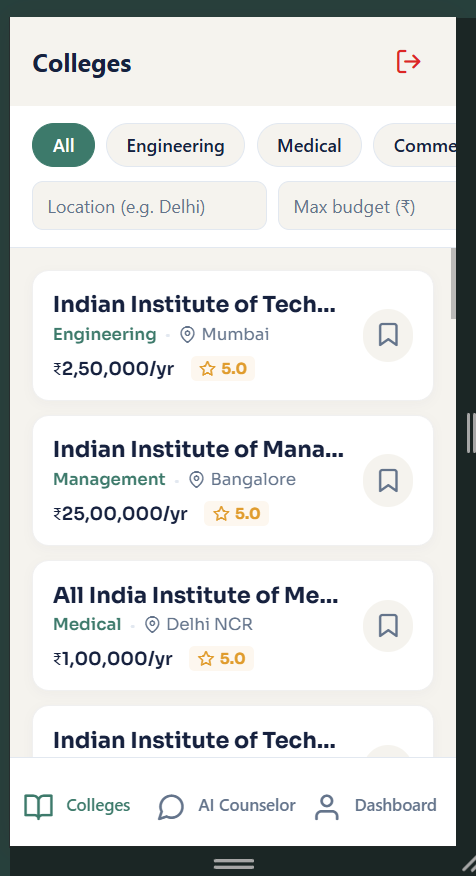
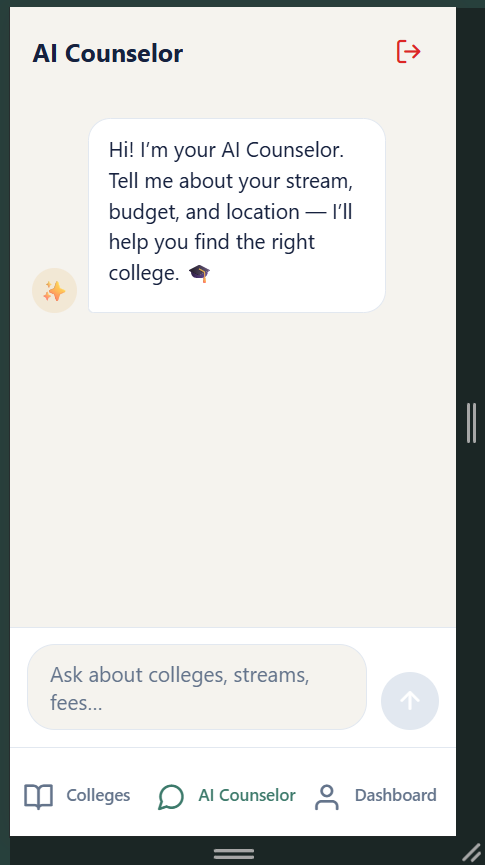

# CampusCompass

CampusCompass is a complete platform designed to help students discover the best colleges, manage their academic profiles, and interact with a smart AI Counselor to find the right career path. 

The project includes a **Web Application**, a cross-platform **Mobile Application**, and a unified **Node.js Backend** API.

---

## Screenshots

### Web Application

*Web Dashboard: Profile completion and bookmarked colleges*


*Web AI Counselor: Markdown-powered AI chat assistance*

### Mobile Application
> **Note:** The mobile app is currently built and optimized for Android only.

*Mobile App: Infinite scrolling colleges feed*


*Mobile App: Native AI Counselor interface*

---

## Tech Stack

### Web App (Frontend)
- **Framework:** Next.js (React)
- **Styling:** Tailwind CSS
- **Routing:** App Router
- **Hosting:** Vercel

### Mobile App
- **Framework:** React Native
- **Toolkit:** Expo & Expo Router
- **UI Components:** Custom UI with Sora Font
- **Navigation:** Bottom Tabs & Modals

### Backend API
- **Framework:** Node.js with Express
- **Database:** MongoDB (via Mongoose)
- **AI Integration:** Groq API / Gemini AI (for the AI Counselor)
- **File Storage:** AWS S3 (for profile photos and documents)
- **Hosting:** AWS Elastic Beanstalk

---

## Features

- **Cross-Platform Parity:** Full feature synchronization between Web and Mobile apps.
- **Secure Authentication:** JWT-based login and signup flow.
- **AWS S3 File Uploads:** Direct-to-S3 file uploads using presigned URLs to bypass server bottlenecks.
- **AI Counselor:** Real-time AI chat that renders markdown formatting perfectly on both web and mobile.
- **Smart Profiles:** Dynamic profile completion tracking (tracks photo, document, stream, budget).
- **Infinite Scrolling:** Optimized mobile college feed with pagination and no-duplicate rendering.
- **Mixed Content Proxy:** Next.js reverse proxy configuration to seamlessly connect HTTPS Vercel frontend with HTTP AWS backend.

---

## Project Structure

```text
campuscompass/
├── backend/          # Node.js + Express API
│   ├── models/       # MongoDB Mongoose schemas
│   ├── routes/       # API endpoints (Auth, Profile, Colleges, AI, Upload)
│   └── utils/        # AWS S3 and AI helper functions
│
├── webapp/           # Next.js Web Frontend
│   ├── app/          # Next.js App Router pages (Dashboard, AI, Auth)
│   ├── components/   # Reusable UI components
│   └── lib/          # API wrappers and generic fetch logic
│
└── mobileapp/        # React Native (Expo) Mobile App
    ├── app/          # Expo Router navigation (Tabs, Modals, Auth)
    ├── components/   # React Native UI components
    └── lib/          # Mobile-specific API and auth logic
```

---

## Running Locally

### 1. Start the Backend
```bash
cd backend
npm install
npm run dev
# Runs on http://localhost:5000
```

### 2. Start the Web App
```bash
cd webapp
npm install
npm run dev
# Runs on http://localhost:3000
```

### 3. Start the Mobile App
```bash
cd mobileapp
npm install
npx expo start
# Scan the QR code with the Expo Go app or press 'w' to run in browser
```

---

## Environment Variables

To run this project locally, you will need to set up the following `.env` files:

**`backend/.env`**
```env
PORT=5000
MONGO_URI=your_mongodb_connection_string
JWT_SECRET=your_jwt_secret
GROQ_API_KEY=your_ai_api_key
AWS_ACCESS_KEY_ID=your_aws_key
AWS_SECRET_ACCESS_KEY=your_aws_secret
AWS_REGION=your_aws_region
AWS_BUCKET_NAME=your_s3_bucket_name
```

**`webapp/.env.local`**
```env
NEXT_PUBLIC_API_URL=http://localhost:5000/api
```

**`mobileapp/.env`**
```env
EXPO_PUBLIC_API_URL=http://localhost:5000/api
```

---

## License
This project is for educational and assessment purposes.
